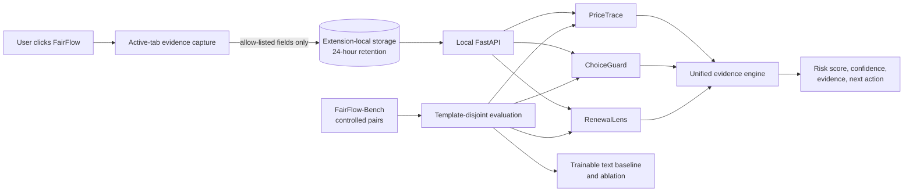

# Architecture

## Trust boundaries

The browser page is untrusted. The capture layer reads only supported roles and never executes page-provided instructions. Extension storage is local and temporary. The API accepts typed, size-bounded observations and does not persist requests. No component performs a purchase, changes a choice, or sends evidence to a remote service.

